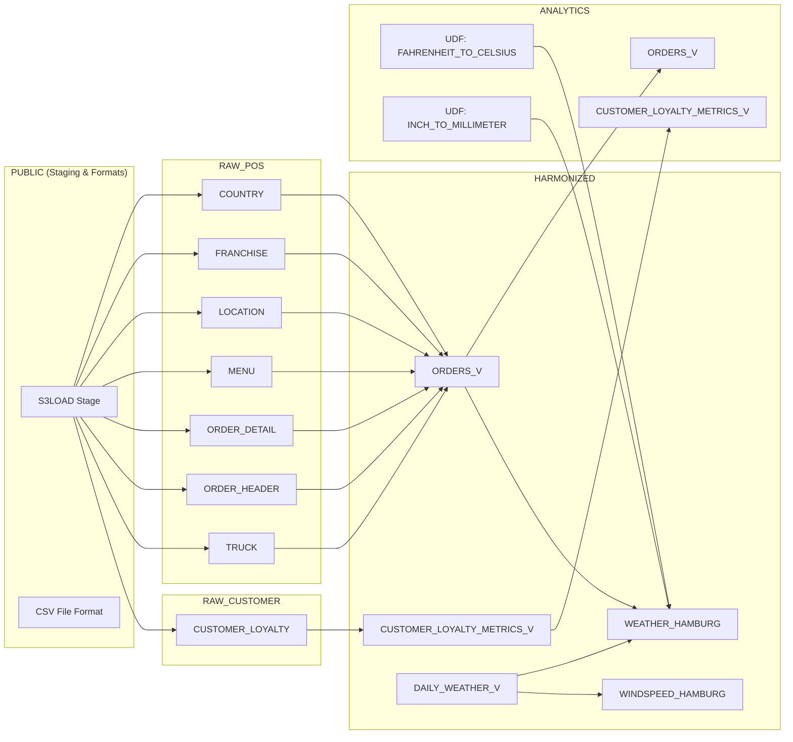
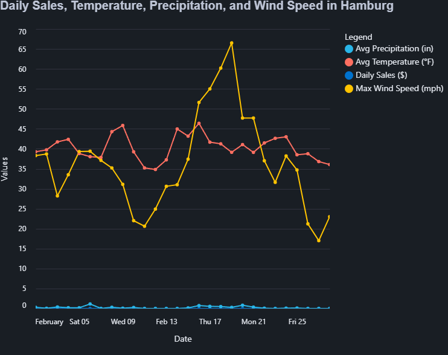

# Investigating Weather-Driven Sales Anomalies Using Snowflake

## Overview

This project investigates a sharp and unexplained drop in sales for Tasty Bytes, a fictional global food truck brand. In February, sales in Hamburg, Germany *dropped to zero*, raising red flags across the business. The central question was:

> Was this due to internal factors like operations or external influences like weather?

To solve this, I built a complete data engineering pipeline in Snowflake, combining internal POS and customer data with external weather data via Snowflake Marketplace. The solution identifies correlations between weather anomalies and sales performance, all visualized through an interactive dashboard.

## Usage of SQL with data modeling

- SQL was used extensively for __data ingestion, cleansing, joins, aggregations, temporal filtering, and view creation__.

- Advanced SQL features like:

  - `GENERATOR()` and `SEQ4()` for date dimension generation.

  - `ZEROIFNULL()` for null-safe aggregations.

  - Complex multi-table joins across POS, customer, truck, and weather datasets.

  - Date functions like `DATEADD`, `DATE_FROM_PARTS`, `DAYOFWEEKISO`, and `YEAR()` for building dynamic date logic.

- User-Defined Functions (UDFs) written in SQL were used to convert:

  - Fahrenheit → Celsius

  - Inches → Millimeters

- All transformations were modularized into layered views, promoting clean architecture across `raw`, `harmonized`, and `analytics` schemas.

The result was a robust, scalable pipeline that not only explained the sales anomaly but also delivered actionable insights—visualized through an interactive dashboard built using __Streamlit + Altair__ directly within Snowflake.

## Tech Stack

- Snowflake (Data Warehouse, SQL, Views, UDFs, Streamlit)

- AWS S3 (Data source for ingestion)

- Snowflake Marketplace (Weather Source LLC data)

- Python + Altair (Streamlit Visualization)

- SQL (Data Modeling & Transformation)

## Data Warehouse structure in Snowflake



## Project Flow / Step-by-Step Approach

1. Data Ingestion & Setup
   - Created schemas for raw, harmonized, and analytics layers:

    ```sql
    CREATE OR REPLACE SCHEMA tasty_bytes.raw_pos;
    CREATE OR REPLACE SCHEMA tasty_bytes.harmonized;
    CREATE OR REPLACE SCHEMA tasty_bytes.analytics;
    ```

    - Defined file format and stage to load raw data from AWS S3:

   ```sql
    CREATE OR REPLACE FILE FORMAT tasty_bytes.public.csv_ff TYPE = 'csv';

    CREATE OR REPLACE STAGE tasty_bytes.public.s3load
    URL = 's3://sfquickstarts/tasty-bytes-builder-education/'
    FILE_FORMAT = tasty_bytes.public.csv_ff;
    ```

    - Loaded sales and customer data (~1 million rows) within 5 seconds:

    ```sql
    COPY INTO tasty_bytes.raw_pos.order_header
    FROM @tasty_bytes.public.s3load/raw_pos/subset_order_header/;
    ```

    - Weather Source LLC dataset on Snowflake Marketplace.

2. Data Modeling & Harmonization
   Created a central view `orders_v` joining all key raw tables (orders, trucks, customers, menu, etc):

   ```sql
    CREATE OR REPLACE VIEW tasty_bytes.harmonized.orders_v AS
    SELECT
    oh.order_id,
    oh.order_ts,
    od.price,
    t.primary_city,
    t.country,
    cl.customer_id,
    m.menu_item_name
    FROM tasty_bytes.raw_pos.order_detail od
    JOIN tasty_bytes.raw_pos.order_header oh ON od.order_id = oh.order_id
    JOIN tasty_bytes.raw_pos.truck t ON oh.truck_id = t.truck_id
    JOIN tasty_bytes.raw_pos.menu m ON od.menu_item_id = m.menu_item_id
    LEFT JOIN tasty_bytes.raw_customer.customer_loyalty cl ON oh.customer_id = cl.customer_id;
   ```

    Created a harmonized weather view filtered to Tasty Byters cities:

    ```sql
    CREATE OR REPLACE VIEW tasty_bytes.harmonized.daily_weather_v AS
    SELECT
    hd.date_valid_std,
    pc.city_name,
    c.country AS country_desc,
    hd.avg_temperature_air_2m_f,
    hd.tot_precipitation_in,
    hd.max_wind_speed_100m_mph
    FROM Weather_Source_LLC_frostbyte.onpoint_id.history_day hd
    JOIN Weather_Source_LLC_frostbyte.onpoint_id.postal_codes pc
    ON pc.postal_code = hd.postal_code AND pc.country = hd.country
    JOIN tasty_bytes.raw_pos.country c
    ON c.iso_country = hd.country AND c.city = pc.city_name;
    ```

3. Transformations & Metric Enrichment
   Created User-Defined Functions (UDFs) for unit conversions:

    ```sql
    CREATE OR REPLACE FUNCTION analytics.fahrenheit_to_celsius(temp_f NUMBER)
    RETURNS NUMBER
    AS $$
    (temp_f - 32) * 5/9
    $$;

    CREATE OR REPLACE FUNCTION analytics.inch_to_millimeter(inch NUMBER)
    RETURNS NUMBER
    AS $$
    inch * 25.4
    $$;
    ```

    Built a unified view that joins weather + sales and applied UDFs:

    ```sql
    CREATE OR REPLACE VIEW harmonized.weather_hamburg AS
    SELECT
    fd.date_valid_std AS date,
    fd.city_name,
    fd.country_desc,
    SUM(odv.price) AS daily_sales,
    ROUND(AVG(fd.avg_temperature_air_2m_f),2) AS avg_temp_f,
    ROUND(AVG(analytics.fahrenheit_to_celsius(fd.avg_temperature_air_2m_f)),2) AS avg_temp_c,
    ROUND(AVG(fd.tot_precipitation_in),2) AS avg_precip_in,
    ROUND(AVG(analytics.inch_to_millimeter(fd.tot_precipitation_in)),2) AS avg_precip_mm,
    MAX(fd.max_wind_speed_100m_mph) AS max_wind_speed_mph
    FROM harmonized.daily_weather_v fd
    LEFT JOIN harmonized.orders_v odv
    ON fd.date_valid_std = DATE(odv.order_ts)
    AND fd.city_name = odv.primary_city
    AND fd.country_desc = odv.country
    WHERE fd.city_name = 'Hamburg' AND fd.yyyy_mm = '2022-02'
    GROUP BY fd.date_valid_std, fd.city_name, fd.country_desc;
    ```

4. Visualization: Streamlit Dashboard

   Built an interactive dashboard using Streamlit within Snowflake, showing:

   - Daily Sales

   - Avg. Temperature (°F)

   - Precipitation (in)

   - Wind Speed (mph)

    All charts were created using Altair for clean, responsive visuals.

    

## Outcome, Business Impact & Use Cases

### Key Insights

- Hamburg experienced abnormally high wind speeds during the days of zero sales in February.

- This supports a clear hypothesis: the food truck could not operate safely due to extreme weather.

- Other weather variables (temperature, precipitation) had less correlation with the anomaly.

### Business Value

- Proactive truck scheduling: Use forecasted wind data to avoid loss days.

- Inventory planning: Prevent food waste by anticipating low footfall.

- Risk management: Flag cities with consistent extreme-weather interruptions.

- Operational resilience: Augment decisions with external data (weather, events, etc.)

## Challenges Faced

- Geospatial matching between weather data (postal codes) and business city names.

- Aligning timezone differences in weather and sales timestamps.

- Handling unit conversions cleanly (°F ↔ °C, in ↔ mm).

- Building a visual that’s informative yet simple enough for business stakeholders.

## Setup Instructions

- Create a Snowflake trial account and login.

- Clone this repo and use the provided SQL scripts to build your data pipeline.

- Load data from AWS S3 using COPY INTO scripts.

- Use `Weather Source LLC` data product via Snowflake Marketplace.

- Create UDFs, views, and run transformation scripts.

- Deploy the dashboard using the Streamlit UI in Snowflake.

This project demonstrates how data engineering isn’t just about pipelines—it’s about delivering insight. With Snowflake's ecosystem and a business-first mindset, external data like weather can become a competitive edge.

> "Bad weather doesn't have to mean bad business—if you're prepared."

bullet point- Engineered a Snowflake-based data pipeline to analyze zero-sales anomalies in Hamburg by integrating ~1M rows of POS data with external weather datasets, identifying high wind speeds as the root cause via SQL-driven transformations, UDFs, and a Streamlit dashboard.
